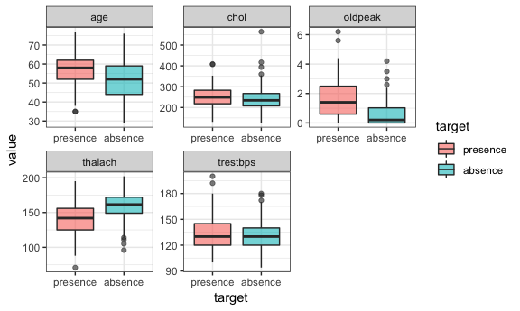
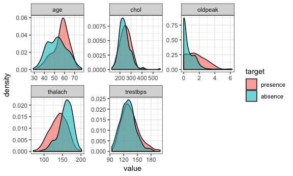
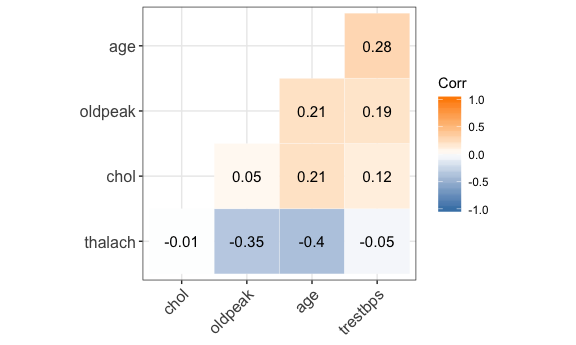
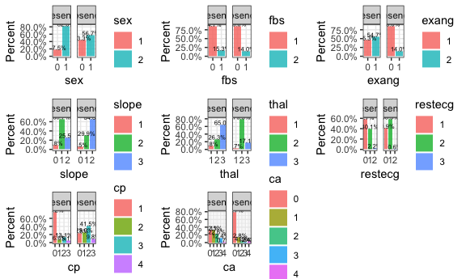
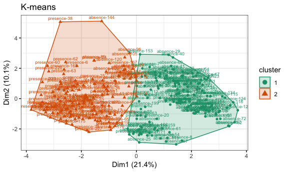
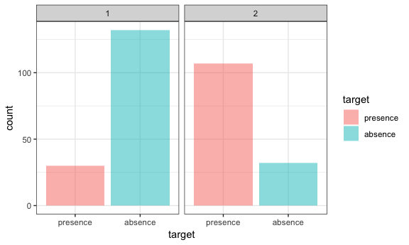
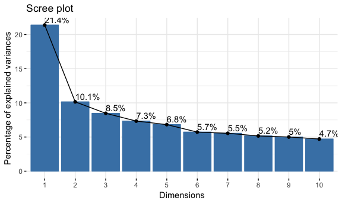
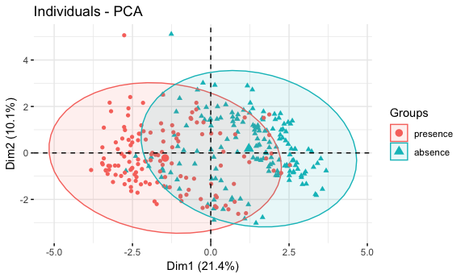
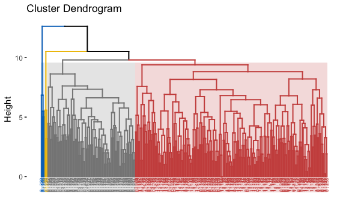
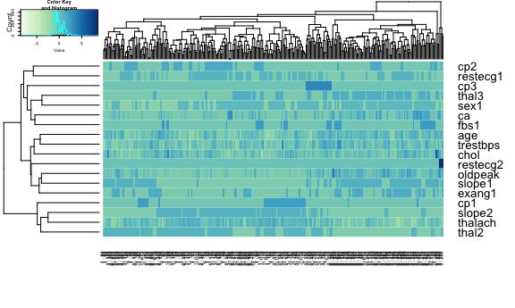

data cleaning
-------------

    heart_disease = read_csv("/Users/pro/Desktop/R/DSII/Predicting-heart-disease-status/data/heart.csv") %>% 
        mutate(target = ifelse(target==1, 0, 1)) %>% 
        mutate(target=as.factor(target)) %>%
        mutate(target=as.factor(ifelse(target==0, "absence", "presence")))%>% 
        mutate(target = relevel(target, "presence")) 

    heart_disease = heart_disease %>% 
        filter(thal != 0) %>% 
        mutate(sex=as.factor(sex),
               cp=as.factor(cp),
               fbs=as.factor(fbs),
               restecg=as.factor(restecg),
               exang=as.factor(exang),
               slope=as.factor(slope),
               thal=factor(thal))

    model.x <- model.matrix(target~.,heart_disease)[,-1]
    model.y <- heart_disease$target

EDA
---

### check missing value

    sapply(X = heart_disease, FUN = function(x) sum(is.na(x)))

    ##      age      sex       cp trestbps     chol      fbs  restecg  thalach 
    ##        0        0        0        0        0        0        0        0 
    ##    exang  oldpeak    slope       ca     thal   target 
    ##        0        0        0        0        0        0

### continuous

    heart_disease %>%
        select(age, trestbps, chol, thalach, oldpeak, target) %>% 
        gather(-target, key = "var", value = "value") %>% 
        ggplot(aes(x = target, y = value, fill = target)) +
        geom_boxplot(alpha = 0.6) +
        facet_wrap(~ var, scales = "free") +
        theme_bw()

    heart_disease %>%
        select(age, trestbps, chol, thalach, oldpeak, target) %>% 
        gather(-target, key = "var", value = "value") %>% 
        ggplot(aes(x = value, fill = target)) +
        geom_density(alpha = 0.6) +
        facet_wrap(~ var, scales = "free") +
        theme_bw()

### corr matrix

    library(ggcorrplot)
    heart_continu = heart_disease %>%
        select(age, trestbps, chol, thalach, oldpeak)
    corr =  round(cor(heart_continu), 4)

    ggcorrplot(corr, hc.order = TRUE, type = "lower",
       outline.col = "white",
       ggtheme = ggplot2::theme_bw,
       lab = T,
       colors =  c("#4682B4", "white", "#FF8C00"))  

### categorical

    barplot = function(var){
        ggplot(heart_disease, aes_string(x = var,  group = "target")) + 
        geom_bar(aes(y = ..prop.., fill = factor(..x..)),
                 stat = "count", alpha = 0.8) +
        geom_text(aes( label = scales::percent(..prop..),
                       y = ..prop.. ), 
                  stat = "count", vjust = 0, size = 2) +
        labs(y = "Percent", fill = var) +
        facet_grid(~target) +
        scale_y_continuous(labels = scales::percent) +
            theme_bw()
    }

    a1 = barplot("sex")
    a2 = barplot("fbs")
    a3 = barplot("exang")
    a4 = barplot("slope")
    a5 = barplot("thal")
    a6 = barplot("restecg")
    a7 = barplot("cp")
    a8 = barplot("ca")

    gridExtra::grid.arrange(a1, a2, a3, a4,
                            a5, a6, a7, a8,
                            ncol = 3, nrow = 3)

tableone
--------

    tableOne = CreateTableOne(vars = c("age", "trestbps", "chol", "thalach",
                                       "oldpeak", "sex", "exang", "fbs", 
                                       "slope", "thal", "restecg", "cp","ca"
                                       ), 
                              strata = c("target"), 
                              data = heart_disease,
                              factorVars = c("sex", "fbs", "exang", "slope",
                                             "thal", "restecg", "cp", "ca"))

    table = print(tableOne, cramVars = c("sex", "exang", "fbs"))

    ##                       Stratified by target
    ##                        presence            absence             p      test
    ##   n                       137                 164                         
    ##   age (mean (SD))       56.64 (7.98)        52.49 (9.58)       <0.001     
    ##   trestbps (mean (SD)) 134.45 (18.79)      129.31 (16.22)       0.011     
    ##   chol (mean (SD))     251.43 (49.47)      242.39 (53.68)       0.133     
    ##   thalach (mean (SD))  138.98 (22.64)      158.73 (18.93)      <0.001     
    ##   oldpeak (mean (SD))    1.59 (1.30)         0.59 (0.78)       <0.001     
    ##   sex = 0/1 (%)        24/113 (17.5/82.5)   71/93 (43.3/56.7)  <0.001     
    ##   exang = 0/1 (%)       62/75 (45.3/54.7)  141/23 (86.0/14.0)  <0.001     
    ##   fbs = 0/1 (%)        116/21 (84.7/15.3)  141/23 (86.0/14.0)   0.877     
    ##   slope (%)                                                    <0.001     
    ##      0                     12 ( 8.8)            9 ( 5.5)                  
    ##      1                     90 (65.7)           49 (29.9)                  
    ##      2                     35 (25.5)          106 (64.6)                  
    ##   thal (%)                                                     <0.001     
    ##      1                     12 ( 8.8)            6 ( 3.7)                  
    ##      2                     36 (26.3)          130 (79.3)                  
    ##      3                     89 (65.0)           28 (17.1)                  
    ##   restecg (%)                                                   0.005     
    ##      0                     79 (57.7)           67 (40.9)                  
    ##      1                     55 (40.1)           96 (58.5)                  
    ##      2                      3 ( 2.2)            1 ( 0.6)                  
    ##   cp (%)                                                       <0.001     
    ##      0                    103 (75.2)           39 (23.8)                  
    ##      1                      9 ( 6.6)           41 (25.0)                  
    ##      2                     18 (13.1)           68 (41.5)                  
    ##      3                      7 ( 5.1)           16 ( 9.8)                  
    ##   ca (%)                                                       <0.001     
    ##      0                     44 (32.1)          129 (78.7)                  
    ##      1                     44 (32.1)           21 (12.8)                  
    ##      2                     31 (22.6)            7 ( 4.3)                  
    ##      3                     17 (12.4)            3 ( 1.8)                  
    ##      4                      1 ( 0.7)            4 ( 2.4)

Unsupervised learning
---------------------

K-means
-------

    set.seed(1)

    model.x_scale = scale(model.x)

    rownames(model.x_scale) = paste(heart_disease$target, 1:228, sep = "-")

    km = kmeans(model.x_scale, centers = 2, nstart = 20)
    km_vis = fviz_cluster(list(data = model.x_scale, 
                                cluster = km$cluster),
                           ellipse.type = "convex",
                           geom = c("point","text"),
                           ggtheme = theme_bw(),
                           labelsize = 7, palette = "Dark2") + 
        labs(title = "K-means")

    km_vis

    heart_kmeans = heart_disease
    heart_kmeans$kmean = km$cluster
    heart_kmeans %>% ggplot(aes(x = target, fill = target)) +
        geom_bar(alpha = 0.5) +
        facet_grid(.~kmean) +
        theme_bw()

    center = t(apply(km$centers, 1, function(r)r*attr(model.x_scale,'scaled:scale') + attr(model.x_scale, 'scaled:center')))

    center

    ##        age      sex1        cp1       cp2        cp3 trestbps     chol
    ## 1 51.39506 0.6049383 0.29012346 0.3827160 0.06172840 128.6790 242.3889
    ## 2 57.85612 0.7769784 0.02158273 0.1726619 0.09352518 135.1079 251.3022
    ##        fbs1  restecg1     restecg2  thalach    exang1  oldpeak    slope1
    ## 1 0.1172840 0.5987654 2.949030e-17 162.2593 0.1172840 0.395679 0.1481481
    ## 2 0.1798561 0.3884892 2.877698e-02 135.1511 0.5683453 1.797842 0.8273381
    ##       slope2        ca     thal2     thal3
    ## 1 0.80864198 0.4691358 0.7962963 0.1851852
    ## 2 0.07194245 1.0431655 0.2661871 0.6258993

PCA
---

    pca <- prcomp(model.x_scale)
    fviz_eig(pca, addlabels = TRUE)

    fviz_pca_ind(pca,
                 habillage = model.y,
                 label = "none",
                 addEllipses = TRUE)

Hierarchical clustering
-----------------------

    hd_1 = heart_disease %>% 
        mutate(target = ifelse(target == "absence",1,0))
    train.hc = model.x_scale %>% as.data.frame() %>% 
        mutate(target = as.character(hd_1$target),
               num = as.character(1:301)) %>% 
        mutate(name = paste(target,".", num)) %>% 
        select(-num, -target) %>% 
        column_to_rownames(var = "name") %>% scale()

    hc.heart = hclust(dist(train.hc), method = "complete")

    fviz_dend(hc.heart, k = 4,
              cex = 0.4,
              palette = "jco",
              color_labels_by_k = TRUE,
              rect = TRUE, rect_fill = TRUE, rect_border = "jco",
              labels_track_height = 0.8)

    col1 <- colorRampPalette(brewer.pal(9, "GnBu"))(100)

    heatmap.2(t(train.hc),
            col = col1, keysize = 1, key.par = list(cex = .3),
            cexRow = 1, 
            #dendrogram = "col",
            trace = "none", key = TRUE, cexCol = 0.4,
            margins = c(5, 5))

