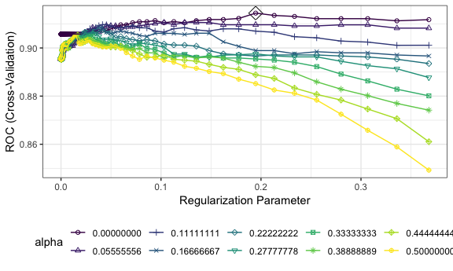
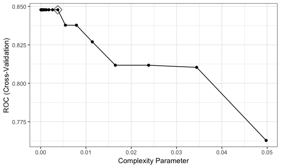
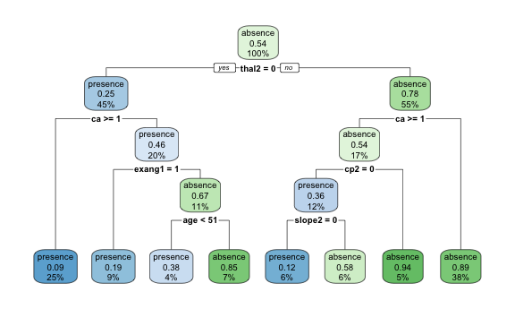
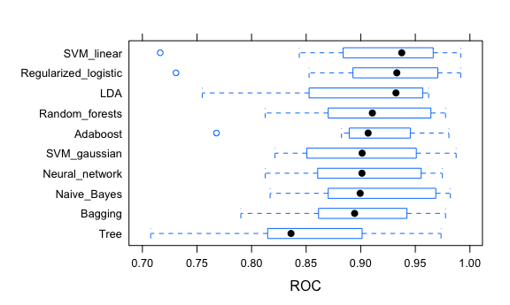
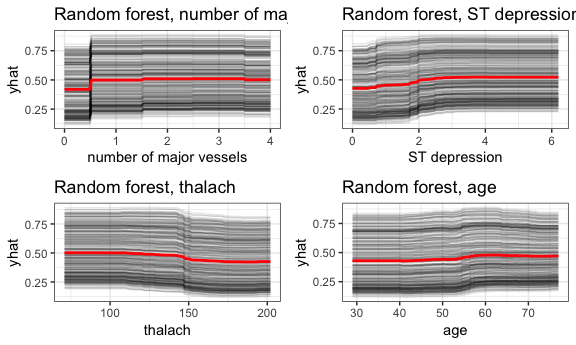
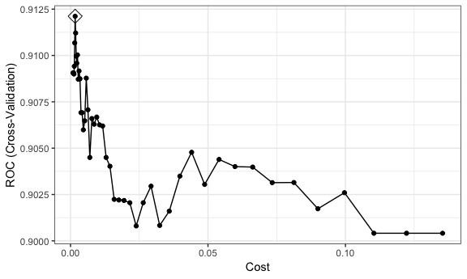
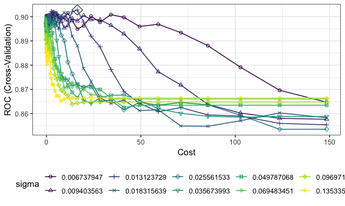
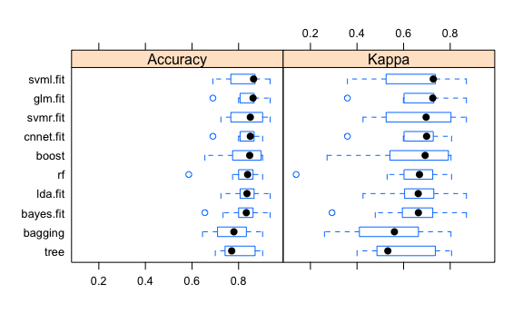

    heart_disease = read_csv("/Users/pro/Desktop/R/DSII/Predicting-heart-disease-status/data/heart.csv") %>% 
        mutate(target = ifelse(target==1, 0, 1)) %>% 
        mutate(target=as.factor(target)) %>%
        mutate(target=as.factor(ifelse(target==0, "absence", "presence")))%>% 
        mutate(target = relevel(target, "presence")) 

    heart_disease = heart_disease %>% 
        filter(thal != 0) %>% 
        mutate(sex=as.factor(sex),
               cp=as.factor(cp),
               fbs=as.factor(fbs),
               restecg=as.factor(restecg),
               exang=as.factor(exang),
               slope=as.factor(slope),
               thal=factor(thal))

    model.x <- model.matrix(target~.,heart_disease)[,-1]
    model.y <- heart_disease$target

Regularized logistic
--------------------

    ctrl = trainControl(method = "cv",
                        classProbs = TRUE,
                        summaryFunction = twoClassSummary)

    glmnGrid <- expand.grid(.alpha = seq(0, 0.5, length = 10),
                            .lambda = exp(seq(-10,-1, length = 100)))
    set.seed(1)
    model.glm <- train(x = model.x,
                       y = model.y,
                       method = "glmnet",
                       tuneGrid = glmnGrid,
                       metric = "ROC",
                       trControl = ctrl)

    ggplot(model.glm, highlight = T)  +
        viridis::scale_color_viridis(discrete = TRUE) + 
        scale_shape_manual(values = seq(1,10))

    ## Scale for 'colour' is already present. Adding another scale for
    ## 'colour', which will replace the existing scale.

    ## Scale for 'shape' is already present. Adding another scale for 'shape',
    ## which will replace the existing scale.

    model.glm$bestTune

    ##    alpha    lambda
    ## 93     0 0.1946867

    glmnet = glmnet(x = model.x, y = model.y, 
           family = "binomial", 
           alpha = 0, 
           lambda = 0.1946867)
    broom::tidy(glmnet)

    ## # A tibble: 19 x 5
    ##    term         step estimate lambda dev.ratio
    ##    <chr>       <dbl>    <dbl>  <dbl>     <dbl>
    ##  1 (Intercept)     1  0.624    0.195     0.431
    ##  2 age             1 -0.00885  0.195     0.431
    ##  3 sex1            1 -0.462    0.195     0.431
    ##  4 cp1             1  0.385    0.195     0.431
    ##  5 cp2             1  0.586    0.195     0.431
    ##  6 cp3             1  0.524    0.195     0.431
    ##  7 trestbps        1 -0.00476  0.195     0.431
    ##  8 chol            1 -0.00120  0.195     0.431
    ##  9 fbs1            1  0.0693   0.195     0.431
    ## 10 restecg1        1  0.246    0.195     0.431
    ## 11 restecg2        1 -0.198    0.195     0.431
    ## 12 thalach         1  0.00952  0.195     0.431
    ## 13 exang1          1 -0.522    0.195     0.431
    ## 14 oldpeak         1 -0.199    0.195     0.431
    ## 15 slope1          1 -0.293    0.195     0.431
    ## 16 slope2          1  0.290    0.195     0.431
    ## 17 ca              1 -0.306    0.195     0.431
    ## 18 thal2           1  0.527    0.195     0.431
    ## 19 thal3           1 -0.526    0.195     0.431

LDA
---

    set.seed(1)
    model.lda = train(x = model.x,
                       y = model.y,
                      method = "lda",
                      metric = "ROC",
                      trControl = ctrl)

Naive bayes
-----------

    set.seed(1)
    nbGrid = expand.grid(usekernel = c(FALSE,TRUE),
                         fL = 1, adjust = seq(0, 4, length = 20))
    model.bayes = train(x = model.x,
                        y = model.y,
                        method = "nb",
                        tuneGrid = nbGrid,
                        metric = "ROC",
                        trControl = ctrl) 

    ggplot(model.bayes, highlight = T)

    model.bayes$bestTune

Tree
----

    set.seed(1)
    tree.class <- train(model.x, model.y,
                        method = "rpart",
                        tuneGrid = data.frame(cp = exp(seq(-10,-3, len = 20))),
                        trControl = ctrl,
                        metric = "ROC")
    ggplot(tree.class, highlight = TRUE)

    tree.class$bestTune

    ##             cp
    ## 13 0.003776539

    rpart.plot(tree.class$finalModel)

Bagging
-------

    bagging.grid <- expand.grid(mtry = 18,
                                splitrule = "gini",
                                min.node.size = 10:50)

    set.seed(1)
    bagging.class <- train(model.x, model.y,
                    method = "ranger",
                    tuneGrid = bagging.grid,
                    metric = "ROC",
                    trControl = ctrl,
                    importance = "impurity")

    ggplot(bagging.class, highlight = TRUE)
    bagging.class$bestTune

    barplot(sort(ranger::importance(bagging.class$finalModel),
                 decreasing = FALSE),
    las = 2, horiz = TRUE, cex.names = 0.7,
    col = colorRampPalette(colors = c("darkred","white","darkblue"))(18))

Random Forest
-------------

    rf.grid <- expand.grid(mtry = 1:6,
                           splitrule = "gini",
                           min.node.size = seq(1,191, by = 2))

    set.seed(1)
    rf.class <- train(model.x, model.y,
                      method = "ranger",
                      tuneGrid = rf.grid,
                      metric = "ROC",
                      trControl = ctrl,
                      importance = "impurity")

    rf.class$bestTune

    ggplot(rf.class, highlight = TRUE) +
        viridis::scale_color_viridis(discrete = TRUE) + 
        scale_shape_manual(values = seq(1,7))

    barplot(sort(ranger::importance(rf.class$finalModel), decreasing = FALSE),
    las = 2, horiz = TRUE, cex.names = 0.7,
    col = colorRampPalette(colors = c("darkred","white","darkblue"))(18))

Boosting
--------

    boost.grid <- expand.grid(n.trees = seq(20, 1700, by = 25),
                              interaction.depth = 1:6,
                              shrinkage =  seq(0.005, 0.06, by = 0.005),
                              n.minobsinnode = 1)

    set.seed(1)
    # Adaboost loss function
    boost.class = train(model.x, model.y,
                        tuneGrid = boost.grid,
                        trControl = ctrl,
                        method = "gbm",
                        distribution = "adaboost",
                        metric = "ROC",
                        verbose = FALSE)

    boost.class$bestTune

    ggplot(boost.class, highlight = TRUE) +
        viridis::scale_color_viridis(discrete = TRUE) + 
        scale_shape_manual(values = seq(0,11))

    summary(boost.class$finalModel, las = 2, cBars = 19, cex.names = 0.6)

SVM ROC
-------

    ## linear boundary
    set.seed(1)
    svml.fit <- train(target~., 
                      data = heart_disease, 
                      method = "svmLinear2",
                      preProcess = c("center", "scale"),
                      tuneGrid = data.frame(cost = exp(seq(-7,-2,len=50))),
                      trControl = ctrl,
                      metric = "ROC")

    ggplot(svml.fit, highlight = TRUE)

    svml.fit$bestTune

    ##          cost
    ## 7 0.001682028

    ## radial kernel
    svmr.grid <- expand.grid(C = exp(seq(-4,5,len=50)),
                             sigma = exp(seq(-5,-2,len=10)))
    set.seed(1)             
    svmr.fit <- train(target~., 
                      data = heart_disease,
                      method = "svmRadial",
                      preProcess = c("center", "scale"),
                      tuneGrid = svmr.grid,
                      trControl = ctrl,
                      metric = "ROC")

    ggplot(svmr.fit, highlight = TRUE) +
        viridis::scale_color_viridis(discrete = TRUE) + 
        scale_shape_manual(values = seq(1,10))
    svmr.fit$bestTune

Neural network
--------------

    nnetGrid <- expand.grid(size = seq(from = 16, to = 30, by = 2), 
                            decay = seq(from = 5, to = 8, length = 30))

    set.seed(1)
    cnnet.fit <- train(target~.,
                       heart_disease,
                       method = "nnet",
                       tuneGrid = nnetGrid,
                       preProcess = c("center","scale"),
                       trControl = ctrl,
                       metric = "ROC",
                       trace = FALSE)

    ggplot(cnnet.fit, highlight = TRUE) + 
        viridis::scale_color_viridis(discrete = TRUE) + 
        scale_shape_manual(values = seq(1,13))

    cnnet.fit$bestTune

    load(file = "/Users/pro/Desktop/R/DSII/Predicting-heart-disease-status/code/saved_results/cnnet.rda") 
    load(file = "/Users/pro/Desktop/R/DSII/Predicting-heart-disease-status/code/saved_results/boost.rda")
    load(file = "/Users/pro/Desktop/R/DSII/Predicting-heart-disease-status/code/saved_results/rf.rda")
    load(file = "/Users/pro/Desktop/R/DSII/Predicting-heart-disease-status/code/saved_results/bagging.rda")
    load(file = "/Users/pro/Desktop/R/DSII/Predicting-heart-disease-status/code/saved_results/bayes.rda")
    load(file = "/Users/pro/Desktop/R/DSII/Predicting-heart-disease-status/code/saved_results/svmr.rda")

    resamp = resamples(list(
                            Regularized_logistic = model.glm,
                            LDA = model.lda,
                            Naive_Bayes = model.bayes,
                            Adaboost = boost.class, 
                            Random_forests = rf.class, 
                            Bagging = bagging.class, 
                            Tree = tree.class,
                            Neural_network = cnnet.fit,
                            SVM_linear = svml.fit,
                            SVM_gaussian = svmr.fit
                            ))
    summary(resamp)

    ## 
    ## Call:
    ## summary.resamples(object = resamp)
    ## 
    ## Models: Regularized_logistic, LDA, Naive_Bayes, Adaboost, Random_forests, Bagging, Tree, Neural_network, SVM_linear, SVM_gaussian 
    ## Number of resamples: 10 
    ## 
    ## ROC 
    ##                           Min.   1st Qu.    Median      Mean   3rd Qu.
    ## Regularized_logistic 0.7307692 0.8962054 0.9330357 0.9144756 0.9674370
    ## LDA                  0.7548077 0.8642988 0.9322479 0.9052986 0.9567308
    ## Naive_Bayes          0.8169643 0.8725103 0.8994829 0.9097952 0.9681490
    ## Adaboost             0.7678571 0.8918572 0.9067752 0.9062419 0.9434086
    ## Random_forests       0.8125000 0.8747424 0.9106335 0.9091185 0.9637605
    ## Bagging              0.7901786 0.8613445 0.8943924 0.8934995 0.9357224
    ## Tree                 0.7075893 0.8175223 0.8361345 0.8478325 0.8964983
    ## Neural_network       0.8125000 0.8641827 0.9010989 0.9026261 0.9553571
    ## SVM_linear           0.7163462 0.8906250 0.9375404 0.9121142 0.9653361
    ## SVM_gaussian         0.8214286 0.8567590 0.9012605 0.9027614 0.9497768
    ##                           Max. NA's
    ## Regularized_logistic 0.9915966    0
    ## LDA                  0.9621849    0
    ## Naive_Bayes          0.9821429    0
    ## Adaboost             0.9807692    0
    ## Random_forests       0.9776786    0
    ## Bagging              0.9776786    0
    ## Tree                 0.9735577    0
    ## Neural_network       0.9747899    0
    ## SVM_linear           0.9915966    0
    ## SVM_gaussian         0.9873950    0
    ## 
    ## Sens 
    ##                           Min.   1st Qu.    Median      Mean   3rd Qu.
    ## Regularized_logistic 0.5384615 0.7321429 0.8214286 0.8027473 0.9065934
    ## LDA                  0.5384615 0.7142857 0.7142857 0.7598901 0.8887363
    ## Naive_Bayes          0.6428571 0.7857143 0.8159341 0.8258242 0.9038462
    ## Adaboost             0.6153846 0.6978022 0.7857143 0.7879121 0.8571429
    ## Random_forests       0.6428571 0.6923077 0.7142857 0.7659341 0.8310440
    ## Bagging              0.6428571 0.6978022 0.7500000 0.7659341 0.8310440
    ## Tree                 0.5384615 0.7142857 0.7417582 0.7516484 0.7857143
    ## Neural_network       0.5714286 0.6923077 0.7857143 0.7950549 0.9065934
    ## SVM_linear           0.5384615 0.7142857 0.7500000 0.7670330 0.8887363
    ## SVM_gaussian         0.5384615 0.6401099 0.7857143 0.7653846 0.8571429
    ##                           Max. NA's
    ## Regularized_logistic 0.9285714    0
    ## LDA                  0.9285714    0
    ## Naive_Bayes          1.0000000    0
    ## Adaboost             1.0000000    0
    ## Random_forests       1.0000000    0
    ## Bagging              0.9285714    0
    ## Tree                 0.9285714    0
    ## Neural_network       1.0000000    0
    ## SVM_linear           0.9285714    0
    ## SVM_gaussian         1.0000000    0
    ## 
    ## Spec 
    ##                           Min.   1st Qu.    Median      Mean   3rd Qu.
    ## Regularized_logistic 0.7500000 0.8125000 0.9099265 0.8830882 0.9411765
    ## LDA                  0.8125000 0.8750000 0.8823529 0.8959559 0.9402574
    ## Naive_Bayes          0.7500000 0.7500000 0.8235294 0.8470588 0.9264706
    ## Adaboost             0.6875000 0.8281250 0.9375000 0.8775735 0.9402574
    ## Random_forests       0.7058824 0.7812500 0.8786765 0.8658088 0.9402574
    ## Bagging              0.6875000 0.7766544 0.8235294 0.8297794 0.8621324
    ## Tree                 0.6875000 0.7656250 0.8786765 0.8411765 0.9237132
    ## Neural_network       0.7500000 0.8152574 0.8786765 0.8838235 0.9411765
    ## SVM_linear           0.6875000 0.8281250 0.9099265 0.8830882 0.9411765
    ## SVM_gaussian         0.7500000 0.8125000 0.8492647 0.8536765 0.9237132
    ##                           Max. NA's
    ## Regularized_logistic 1.0000000    0
    ## LDA                  1.0000000    0
    ## Naive_Bayes          1.0000000    0
    ## Adaboost             0.9411765    0
    ## Random_forests       1.0000000    0
    ## Bagging              1.0000000    0
    ## Tree                 0.9411765    0
    ## Neural_network       1.0000000    0
    ## SVM_linear           1.0000000    0
    ## SVM_gaussian         0.9411765    0

    bwplot(resamp, metric = "ROC")

### centered ICE

    ice_thalach.rf = rf.class %>%
        pdp::partial(pred.var = "thalach",
                grid.resolution = 100,
                ice = TRUE, 
                prob = TRUE) %>%
        autoplot(train = heart_disease, alpha = .1) +
        ggtitle("Random forest, thalach")

    ice_ca.rf = rf.class %>%
        pdp::partial(pred.var = "ca",
                grid.resolution = 100,
                ice = TRUE, 
                prob = TRUE) %>%
        autoplot(train = heart_disease, alpha = .1, 
                 xlab = "number of major vessels") +
        ggtitle("Random forest, number of major vessels")

    ice_oldpeak.rf =  rf.class %>%
        partial(pred.var = "oldpeak",
                grid.resolution = 100,
                ice = TRUE,
                prob = TRUE) %>%
        autoplot(train = heart_disease, alpha = .1, 
                 xlab = "ST depression") +
        ggtitle("Random forest, ST depression")

    ice_age.rf = rf.class %>%
        pdp::partial(pred.var = "age",
                grid.resolution = 100,
                ice = TRUE, 
                prob = TRUE) %>%
        autoplot(train = heart_disease, alpha = .1) +
        ggtitle("Random forest, age")

    grid.arrange(ice_ca.rf, ice_oldpeak.rf,   
                 ice_thalach.rf, ice_age.rf, nrow = 2)

Variable importance
-------------------

    library(gbm)

    ## Loaded gbm 2.1.5

    varImp(model.glm)

    ## glmnet variable importance
    ## 
    ##           Overall
    ## cp2      100.0000
    ## thal2     89.9806
    ## thal3     89.6862
    ## cp3       89.4418
    ## exang1    89.0051
    ## sex1      78.8641
    ## cp1       65.6297
    ## ca        52.1442
    ## slope1    49.9843
    ## slope2    49.3128
    ## restecg1  41.8379
    ## oldpeak   33.7996
    ## restecg2  33.6822
    ## fbs1      11.6544
    ## thalach    1.4232
    ## age        1.3083
    ## trestbps   0.6093
    ## chol       0.0000

    varImp(model.lda)

    ## ROC curve variable importance
    ## 
    ##          Importance
    ## thal2      100.0000
    ## thalach     95.2812
    ## thal3       90.1317
    ## oldpeak     89.9165
    ## ca          89.7356
    ## exang1      76.2594
    ## slope2      73.0991
    ## slope1      66.7700
    ## cp2         52.2776
    ## age         51.1237
    ## sex1        47.3435
    ## cp1         33.1353
    ## restecg1    33.0578
    ## chol        25.1356
    ## trestbps    24.9634
    ## cp3          6.4669
    ## restecg2     0.5339
    ## fbs1         0.0000

    varImp(model.bayes)

    ## ROC curve variable importance
    ## 
    ##          Importance
    ## thal2      100.0000
    ## thalach     95.2812
    ## thal3       90.1317
    ## oldpeak     89.9165
    ## ca          89.7356
    ## exang1      76.2594
    ## slope2      73.0991
    ## slope1      66.7700
    ## cp2         52.2776
    ## age         51.1237
    ## sex1        47.3435
    ## cp1         33.1353
    ## restecg1    33.0578
    ## chol        25.1356
    ## trestbps    24.9634
    ## cp3          6.4669
    ## restecg2     0.5339
    ## fbs1         0.0000

    varImp(boost.class)

    ## gbm variable importance
    ## 
    ##           Overall
    ## ca       100.0000
    ## oldpeak   79.6457
    ## thal2     77.0270
    ## thalach   61.2231
    ## chol      52.8994
    ## trestbps  50.8206
    ## age       42.3494
    ## exang1    40.8228
    ## cp2       28.2991
    ## thal3     28.0742
    ## sex1      19.9508
    ## cp3       19.4944
    ## slope2    17.4076
    ## slope1     9.4854
    ## restecg1   8.0607
    ## cp1        7.8021
    ## fbs1       0.9966
    ## restecg2   0.0000

    varImp(rf.class)

    ## ranger variable importance
    ## 
    ##          Overall
    ## thal2    100.000
    ## ca        94.184
    ## thal3     78.793
    ## oldpeak   77.081
    ## thalach   71.046
    ## exang1    59.586
    ## slope2    49.347
    ## age       48.026
    ## cp2       34.566
    ## chol      33.949
    ## sex1      32.134
    ## slope1    31.905
    ## trestbps  30.498
    ## cp1       15.616
    ## restecg1  10.725
    ## cp3        8.663
    ## fbs1       2.118
    ## restecg2   0.000

    varImp(bagging.class)

    ## ranger variable importance
    ## 
    ##            Overall
    ## thal2    100.00000
    ## ca        47.18886
    ## oldpeak   32.70738
    ## thalach   27.53944
    ## age       14.77607
    ## exang1    13.43368
    ## trestbps  10.65010
    ## cp2       10.41997
    ## thal3      9.60369
    ## chol       8.71625
    ## cp3        5.61067
    ## slope2     3.96182
    ## sex1       3.24090
    ## restecg1   1.96555
    ## slope1     1.74960
    ## cp1        0.74229
    ## fbs1       0.04796
    ## restecg2   0.00000

    varImp(tree.class)

    ## rpart variable importance
    ## 
    ##          Overall
    ## thalach  100.000
    ## ca        96.684
    ## exang1    87.087
    ## thal2     80.067
    ## thal3     68.075
    ## oldpeak   37.514
    ## age       25.951
    ## slope2    17.578
    ## cp2       15.249
    ## sex1      14.902
    ## slope1    13.928
    ## cp3        8.264
    ## chol       7.543
    ## cp1        4.269
    ## restecg1   0.000
    ## restecg2   0.000
    ## fbs1       0.000
    ## trestbps   0.000

    varImp(cnnet.fit)

    ## nnet variable importance
    ## 
    ##          Overall
    ## ca       100.000
    ## thal2     85.381
    ## thal3     82.923
    ## cp2       82.012
    ## exang1    77.280
    ## oldpeak   71.835
    ## thalach   68.244
    ## sex1      65.485
    ## slope2    44.568
    ## slope1    44.370
    ## cp1       40.316
    ## cp3       38.814
    ## restecg1  32.957
    ## trestbps  21.097
    ## age       21.068
    ## chol      12.338
    ## fbs1       1.239
    ## restecg2   0.000

Comparing accuracy
==================

Regularized logistic
--------------------

    ctrl2 <- trainControl(method = "cv")

    glmnGrid <- expand.grid(.alpha = 0,
                            .lambda = 0.2335065)

    set.seed(1)
    model.glm.2 <- train(x = model.x,
                       y = model.y,
                       tuneGrid = glmnGrid,
                       method = "glmnet",
                       metric = "Accuracy",
                       trControl = ctrl2)

LDA
---

    set.seed(1)
    model.lda.2 = train(x = model.x,
                      y = model.y,
                      method = "lda",
                      metric = "Accuracy",
                      trControl = ctrl2)

Naive bayes
-----------

    set.seed(1)
    nbGrid = expand.grid(usekernel = TRUE,
                         fL = 1, adjust = 1.473684)
    model.bayes.2 = train(x = model.x,
                        y = model.y,
                        method = "nb",
                        tuneGrid = nbGrid,
                        metric = "Accuracy",
                        trControl = ctrl2) 

Tree
----

    set.seed(1)
    tree.class.2 <- train(model.x, model.y,
                        method = "rpart",
                        tuneGrid = data.frame(cp = 0.003776539),
                        trControl = ctrl2,
                        metric = "Accuracy")

Bagging
-------

    bagging.grid <- expand.grid(mtry = 18,
                                splitrule = "gini",
                                min.node.size = 40)

    set.seed(1)
    bagging.class.2 <- train(model.x, model.y,
                    method = "ranger",
                    tuneGrid = bagging.grid,
                    metric = "Accuracy",
                    trControl = ctrl2,
                    importance = "impurity")

Random Forest
-------------

    rf.grid <- expand.grid(mtry = 1,
                           splitrule = "gini",
                           min.node.size = 25)

    set.seed(1)
    rf.class.2 <- train(model.x, model.y,
                      method = "ranger",
                      tuneGrid = rf.grid,
                      metric = "Accuracy",
                      trControl = ctrl2,
                      importance = "impurity")

Boosting
--------

    boost.grid <- expand.grid(n.trees = 1370,
                              interaction.depth = 1,
                              shrinkage = 0.015,
                              n.minobsinnode = 1)

    set.seed(1)
    # Adaboost loss function
    boost.class.2 = train(model.x, model.y,
                        tuneGrid = boost.grid,
                        trControl = ctrl2,
                        method = "gbm",
                        distribution = "adaboost",
                        metric = "Accuracy",
                        verbose = FALSE)

Neural network
--------------

    nnetGrid <- expand.grid(size = 18, 
                            decay = 6.448276)

    set.seed(1)
    cnnet.fit.2 <- train(target~.,
                       heart_disease,
                       method = "nnet",
                       tuneGrid = nnetGrid,
                       preProcess = c("center","scale"),
                       trControl = ctrl2,
                       metric = "Accuracy",
                       trace = FALSE)

SVM
---

    ## linear boundary
    set.seed(1)
    svml.fit.2 <- train(target~., 
                      data = heart_disease, 
                      method = "svmLinear2",
                      preProcess = c("center", "scale"),
                      tuneGrid = data.frame(cost = exp(seq(-7,-2,len=50))),
                      trControl = ctrl2)

    ggplot(svml.fit, highlight = TRUE)

    svml.fit$bestTune

    ##          cost
    ## 7 0.001682028

    ## radial kernel
    svmr.grid <- expand.grid(C = exp(seq(-4,5,len=50)),
                             sigma = exp(seq(-5,-2,len=10)))
    set.seed(1)             
    svmr.fit.2 <- train(target~., 
                      data = heart_disease,
                      method = "svmRadial",
                      preProcess = c("center", "scale"),
                      tuneGrid = svmr.grid,
                      trControl = ctrl2)

    ggplot(svmr.fit, highlight = TRUE) +
        viridis::scale_color_viridis(discrete = TRUE) + 
        scale_shape_manual(values = seq(1,10))

    svmr.fit$bestTune

    ##          sigma        C
    ## 373 0.01312373 16.37766

    resamp = resamples(list(
                            glm.fit = model.glm.2,
                            lda.fit = model.lda.2,
                            bayes.fit = model.bayes.2,
                            boost = boost.class.2, 
                            rf = rf.class.2, 
                            bagging = bagging.class.2, 
                            tree = tree.class.2,
                            cnnet.fit = cnnet.fit.2,
                            svml.fit = svml.fit.2,
                            svmr.fit = svmr.fit.2
                            ))
    summary(resamp)

    ## 
    ## Call:
    ## summary.resamples(object = resamp)
    ## 
    ## Models: glm.fit, lda.fit, bayes.fit, boost, rf, bagging, tree, cnnet.fit, svml.fit, svmr.fit 
    ## Number of resamples: 10 
    ## 
    ## Accuracy 
    ##                Min.   1st Qu.    Median      Mean   3rd Qu.      Max. NA's
    ## glm.fit   0.6896552 0.8145161 0.8620690 0.8398739 0.8666667 0.9354839    0
    ## lda.fit   0.7241379 0.8064516 0.8360215 0.8336522 0.8655172 0.9354839    0
    ## bayes.fit 0.6551724 0.8016129 0.8331479 0.8164182 0.8562291 0.9354839    0
    ## boost     0.6551724 0.7806452 0.8477011 0.8265406 0.8901557 0.9032258    0
    ## rf        0.5862069 0.8083333 0.8387097 0.8165184 0.8620690 0.9032258    0
    ## bagging   0.6451613 0.7132925 0.7798851 0.7778309 0.8266129 0.9032258    0
    ## tree      0.7000000 0.7461068 0.7704301 0.8007564 0.8687430 0.9032258    0
    ## cnnet.fit 0.6896552 0.8145161 0.8503893 0.8334223 0.8655172 0.9032258    0
    ## svml.fit  0.6896552 0.7846774 0.8643678 0.8331072 0.8709677 0.9354839    0
    ## svmr.fit  0.7241379 0.7766129 0.8503893 0.8367779 0.8940860 0.9354839    0
    ## 
    ## Kappa 
    ##                Min.   1st Qu.    Median      Mean   3rd Qu.      Max. NA's
    ## glm.fit   0.3587224 0.6194035 0.7251185 0.6745092 0.7291155 0.8697479    0
    ## lda.fit   0.4257426 0.6042553 0.6628142 0.6605989 0.7285769 0.8697479    0
    ## bayes.fit 0.2926829 0.5957304 0.6634589 0.6288495 0.7119150 0.8697479    0
    ## boost     0.2713568 0.5545683 0.6924155 0.6458114 0.7783146 0.8033827    0
    ## rf        0.1386139 0.6164858 0.6680394 0.6252192 0.7251185 0.8058455    0
    ## bagging   0.2603037 0.4118824 0.5605055 0.5466845 0.6488217 0.8033827    0
    ## tree      0.4000000 0.4875493 0.5322399 0.5959460 0.7313960 0.8058455    0
    ## cnnet.fit 0.3587224 0.6183510 0.6987115 0.6613114 0.7267342 0.8058455    0
    ## svml.fit  0.3587224 0.5617413 0.7274241 0.6609499 0.7361702 0.8697479    0
    ## svmr.fit  0.4257426 0.5447290 0.6966064 0.6675820 0.7849694 0.8697479    0

    bwplot(resamp)

